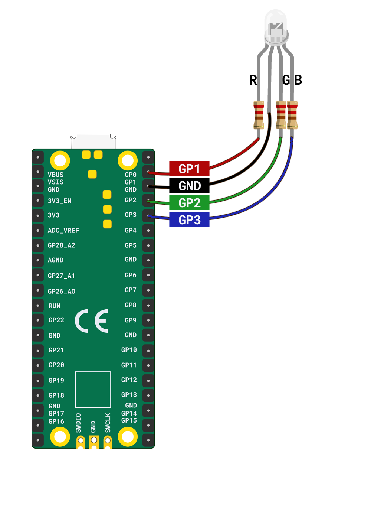

You will need:

+ A Raspberry Pi Pico
+ An RGB LED
+ 3 x resistors
+ 8 x socket-socket jumper wires

**Note:** You will need to attach resistors to the three shorter legs of the RGB LED. The longer leg is for **Ground** and doesn't require a resistor.

