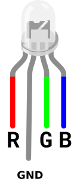

Je hebt nodig:

+ Een Raspberry Pi Pico
+ RGB-led met gemeenschappelijke kathode
+ 3 x weerstand
+ 8 x bus-bus verbindingsdraden

**Opmerking:** Je moet de weerstanden aan de drie kortere benen van de RGB LED verbinden. Het langere been is voor **aarde** en daar hoef je geen weerstand op aan te sluiten.

**Kijk:** Je RGB LED heeft vier benen. Draai je RGB LED zodat het langere **GND** been de tweede van links is. Zie hoe de benen eruit zien **R** voor **rood**, dan **GND**, dan **G** voor **groen** en tenslotte **B** voor **blauw**. Dit helpt je om je te herinneren wat elk been doet.

**Aansluiten:** bedraad je RGB-led

+ Bevestig de **R** been aan **GP1**
+ Bevestig de **GND** aan de **GND** pin
+ Bevestig het **G** been aan de **GP2** pin
+ Bevestig het **B** been aan de **GP3** pin

